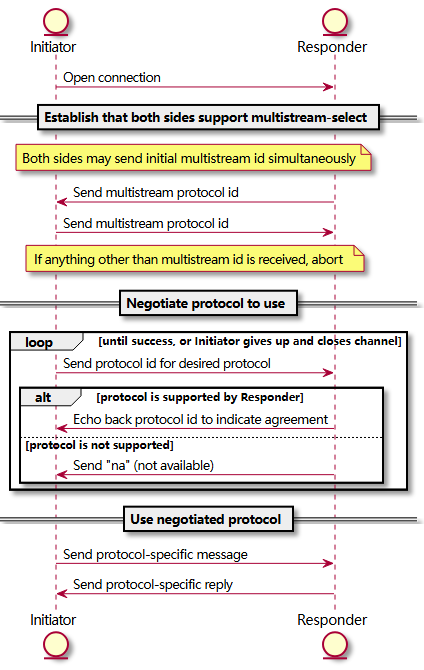
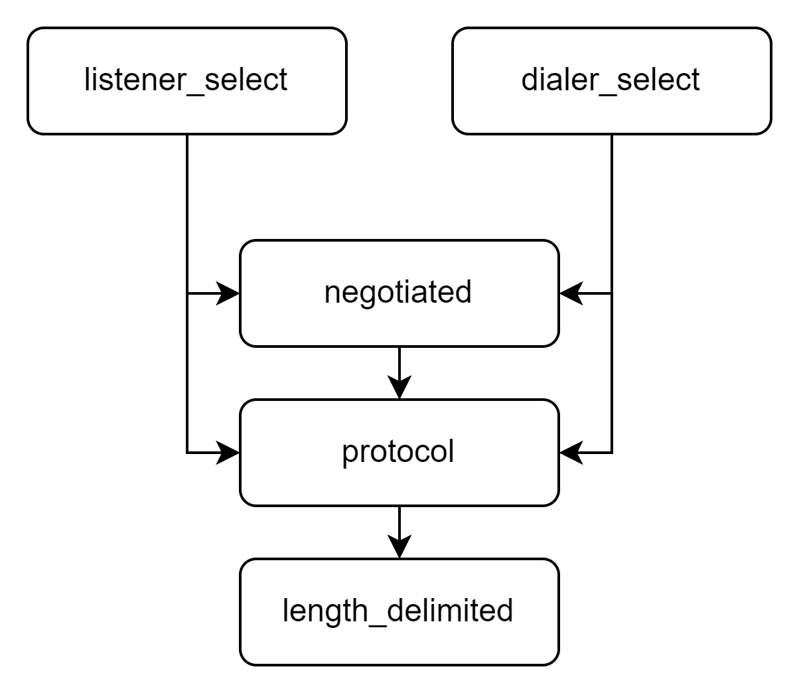

# multistream-select代码结构速览

在进入正式内容之前，有必要对multistream-select库的作用作简要了解。

- [libp2p的Connection是如何建立的？](https://github.com/libp2p/specs/blob/master/connections/README.md#multistream-select)
- [multistream-select代码仓库地址](https://github.com/multiformats/multistream-select?tab=readme-ov-file#motivation)

Libp2p库的设计初衷之一是尽可能支持更多的网络环境，因此它支持一大堆网络协议。这样做势必引入了一个问题：一个节点启动的时候，它咋知道要用哪个协议和某个给定网络连接呢？这时候Libp2p就给出了一个方案，称为协议的协商（Protocol Negotiation），即节点在连接建立的时候，先协商出双方都支持的协议，然后再进行后续的通信，不就解决了嘛！

> 实际上协议协商不是个新鲜话题。例如，HTTP协议、SMTP协议、FTP协议、SSH协议等，它们都运行在计算机网络层级模型的应用层上，如何确定一次通讯要使用哪种协议呢？答案是，使用端口号加以区分，例如FTP的21端口、HTTP的80端口、SMTP的25端口、SSH的22端口等。在这里，Libp2p不再用知名端口号的方法来区分了，而是为了协议协商专门设计了一个`multistream-select`子协议出来。

但是这又引出了一个新问题：还没确定用啥协议，怎么协商呢？这时候就需要multistream-select库的帮助了。简而言之，Libp2p使用了一个称为`multistream-select`的协议，用这个统一的协议来协商后续使用的通信协议，这样就解决了协议协商的问题。

一次完整的协议协商流程如下图所示。



其大概可以分为两个阶段。第一阶段，先建立一个multistream协议的连接：

1. 发起者向回应者发送开启连接的请求；
2. 回应者返回一个Multistream协议ID，连接建立。

第二阶段，协议协商：

1. 发起者发送刚刚接收到的Multistream协议ID，好让对方知道这是谁在协商；
2. 发起者发送一个自己支持的协议ID，等待回应；
3. 回应者若支持该协议，则复读一次这个协议ID，否则返回"na\n"，返回第2步；
4. 若进行到该步，则说明通信双方均已选定协议，连接建立，可以正常进行后续通信。

第二步可能出现另一种情况，即发起者在发送了Multistream协议ID后，紧接着发送一个"ls\n"指令，要求回应者给出它支持的协议列表。但不是每个回应者都有支持这个指令，所以大多数情况下还是会遵从图中的流程的。

具有了以上知识储备，让我们开始分析代码吧。

## src/lib.rs

库文件的主文件肯定是最值得我们付诸注意力的。在文件一开头的注释中，我们就可以看到描述协议协商multistream-select协议的内容。它指出了协议协商中的另一种特殊情况，即：若采用V1Lazy版本的协议，且发起者只支持一种协议的话，那么它就会默认协商已完成，当然在第一次通信的时候还是会询问一下回应者是否接受这种协议的。多说无益，来看看注释中的示例代码：

```rust
use async_std::net::TcpStream;
use multistream_select::{dialer_select_proto, Version};
use futures::prelude::*;

async_std::task::block_on(async move {
    // 先建立一个朴实无华的TCP连接，连接到对面的回应者那边去
    let socket = TcpStream::connect("127.0.0.1:10333").await.unwrap();
    // 这是发起者支持的所有协议
    let protos = vec[b"/echo/1.0.0", b"/echo/2.5.0"];
    // 通过刚才建立的TCP连接，向对面的回应者询问支持的协议。
    // 这个过程可能会失败，所以需要用`.umwrap()`来处理
    let (protocol, _io) = dialer_select_proto(socket, protos, Version::V1).await.unwrap();
    // 输出协商后的协议
    println("Negotiated protocol: {:?}", protocol);
    // 现在可以用变量`_io`和回应者交流啦
});
```

在向外暴露了一大堆子模块之后，lib.rs定义了一个表征Multistream-select协议的**版本**的枚举`Version`，枚举的内容很简单，只有`Version::V1`、`Version::V1Lazy`和尚在开发已被注释掉的`Version::V2`。此外，lib.rs还为`Version`实现了`Default` trait，并设定`Version::V1`为其默认选项。

> 枚举中包含了很多注释，绝大多数都在描述V1Lazy。简而言之，V1Lazy版本允许发起者将协议协商信息和真正要传输的信息打包在一起发给回应者，从而省去了一个步骤。
>
> 这个过程必须满足这个要求才能发生：发起人只支持一种协议。

这个文件里的内容不多，接下来我们去看看它的5个模块吧。



## length_delimited模块

这是所有5个模块中唯一一个没有对外暴露的模块，即：这个模块是供multistream-select库内部使用的。我们就从它开始研究。

> 这里常见的`let this = self.project()`是什么意思呢？
>
> 异步Rust已经提出，有些数据结构需要Pin在内存里不动。这时，有个叫pin-project的库为我们提供了访问被pin的数据的途径。

梗概地说，这个文件实现了一个`LengthDelimited`结构体。这个结构体内部有：数据源`inner`、读取缓冲区`read_buffer`和发送缓冲区`write_buffer`，能够**异步地**从指定数据源读写字节流（读和写分别对应`futures`的`Stream`和`Sink` trait）。

在`LengthDelimited`的基础上，进一步实现了`LengthDelimitedReader`结构体。这个结构体包装了一次`LengthDelimited`，除了实现`Stream` trait外还实现了`AsyncWrite` trait（本质上是调用了内部`LengthDelimited`的`Sink`方法）。

根据VS Code的结果，这东西只在protocol.rs中被用到了。因此，我们将到protocol.rs中看看。

## protocol模块

该模块实现了`multistream-select`协议。这个协议的详细工作流程已在上文介绍，这里补充说明一个点：协议的每条消息（对应`Message`结构）都包含两节，第一节是个`u8`大小的字段，表示信息的长度；第二节是具体的消息内容。

该模块将`LengthDelimited`进一步包装成`MessageIO`、将`LengthDelimitedReader`进一步包装成`MessageRead`。另外实现了`poll_stream`函数，用于从一个异步数据流中读取`Message`结构。

## dialer_select模块

## listener_select模块


## negotiated模块